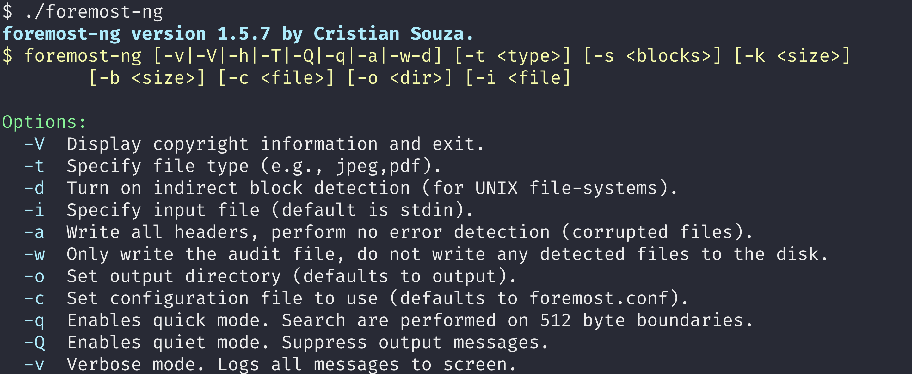
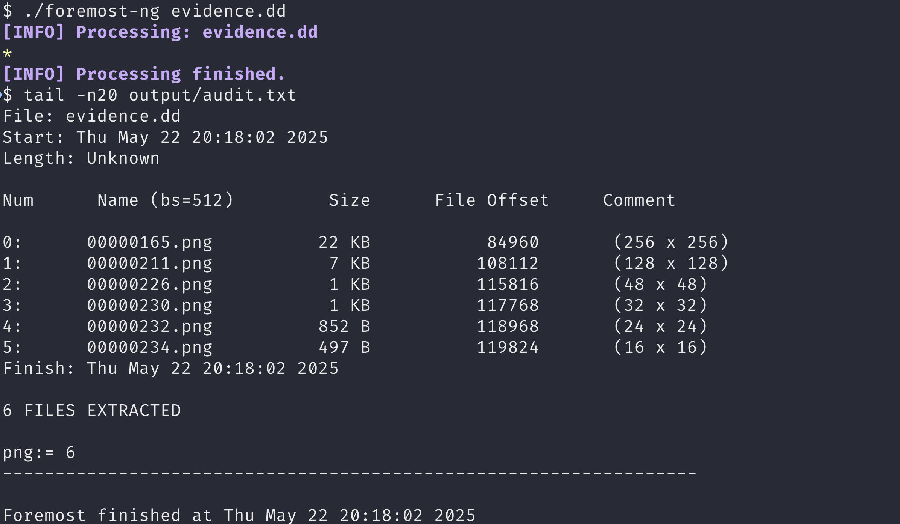

# foremost-ng

`foremost-ng` is a Linux-based file recovery tool that extracts files from disk images or devices by scanning for configurable file headers and footers. It supports common forensic formats (e.g., `.dd`, Safeback, Encase) and can operate on both image files and live devices.
> ⚡ This fork aims to modernize the codebase, improve terminal output with ANSI styling, and introduce new features for forensic analysis and data recovery.




---

## Features

- 🧩 Recover files based on headers and footers.
- ⚙️ Configurable file signatures via a plain-text configuration file.
- 🪛 Supports header-only or header–footer scans.
- 🧱 Works on forensic images or live drives.

---

## Installation

Clone or download the `foremost-ng` archive, then build and install according to your platform:

```bash
# Common steps
tar xzvf foremost-ng-<version>.tar.gz
cd foremost-ng-<version>/src
```

### Linux
```bash
make
sudo make install
```

### BSD
```bash
make unix
sudo gmake install
```

### macOS
```bash
make mac
sudo make macinstall
```

> **Note:** On systems with glibc < 2.2.0, you may see harmless warnings about `ftello` and `fseeko`. These can be safely ignored.

---

## Usage

Run `foremost-ng` with the appropriate command-line options. For full details, refer to the manual page:

```bash
man foremost-ng
```

Basic syntax:
```bash
foremost-ng [options] [image_or_device]
```

---

## Uninstallation

To remove `foremost-ng` from your system:

```bash
cd foremost-ng-<version>/src
sudo make uninstall
```
